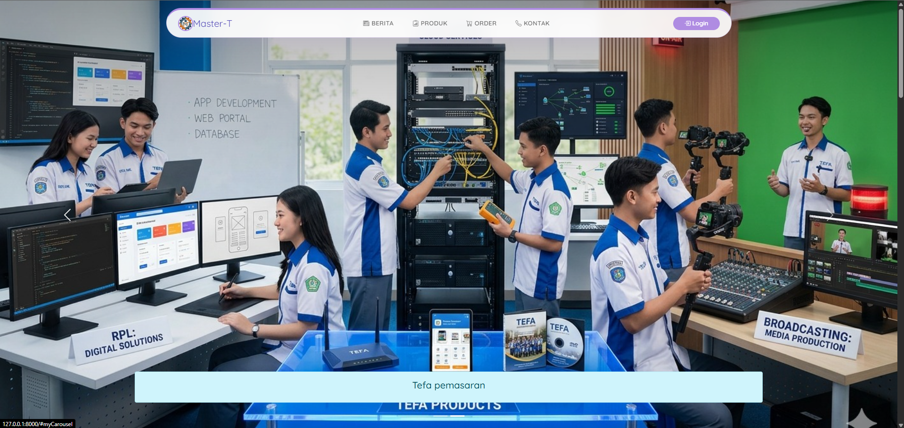
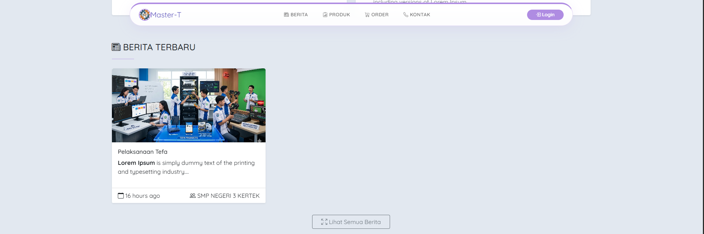
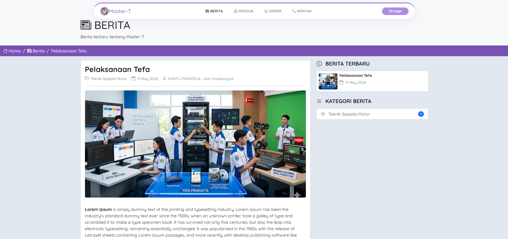
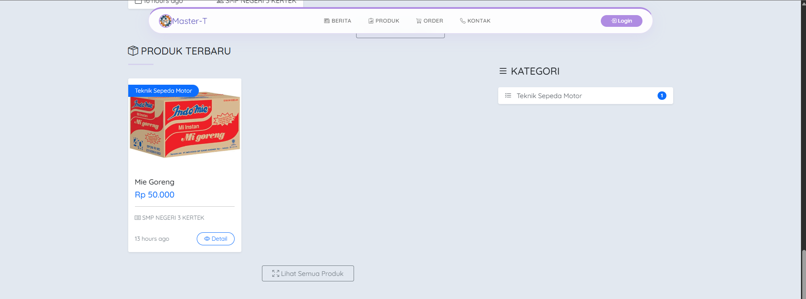
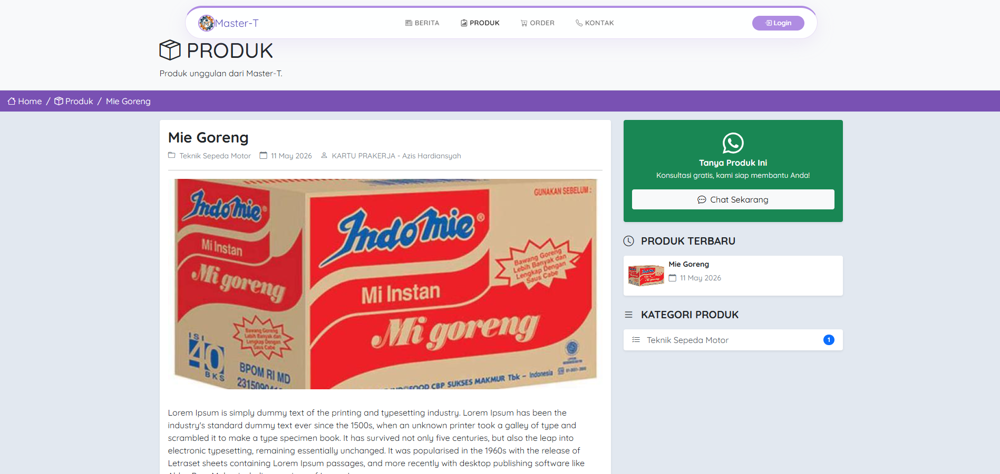
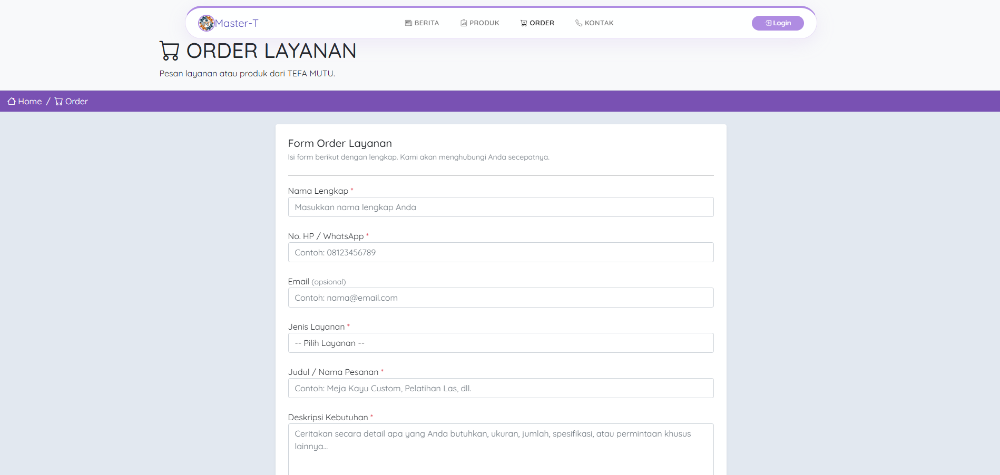
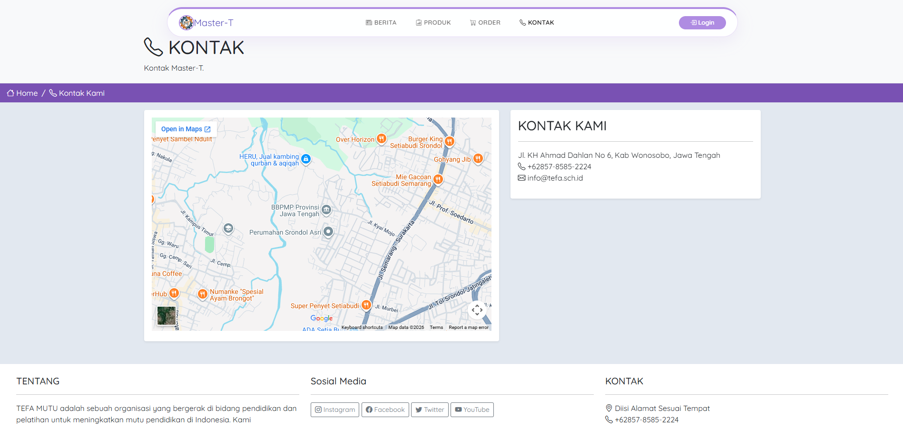
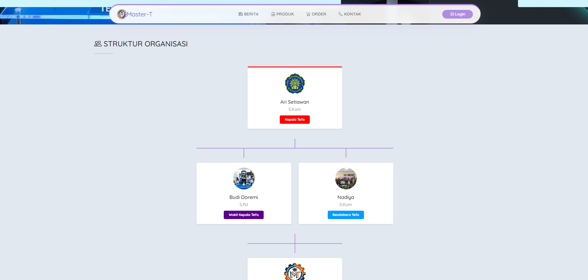
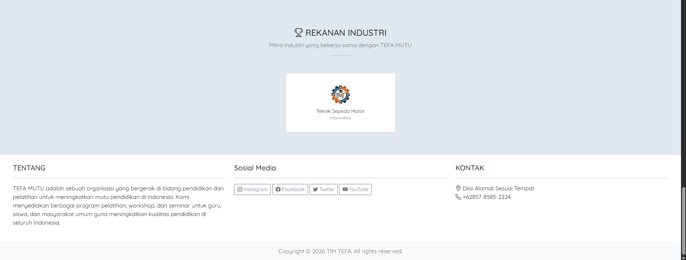

<div align="center">


# TEFA MUTU

### Website Sekolah & Layanan Industri

**Teaching Factory — Platform Digital Resmi Sekolah Vokasi**

[](https://laravel.com)
[](https://php.net)
[](https://getbootstrap.com)
[](https://mysql.com)
[](https://vitejs.dev)
[](LICENSE)

</div>

---

## 📋 Daftar Isi

- [Tentang Proyek](#-tentang-proyek)
- [Fitur Utama](#-fitur-utama)
- [Screenshot](#-screenshot)
- [Arsitektur & Teknologi](#-arsitektur--teknologi)
- [Struktur Direktori](#-struktur-direktori)
- [Prasyarat Sistem](#-prasyarat-sistem)
- [Panduan Instalasi](#-panduan-instalasi)
    - [1. Clone Repositori](#1-clone-repositori)
    - [2. Instalasi Dependensi](#2-instalasi-dependensi)
    - [3. Konfigurasi Environment](#3-konfigurasi-environment)
    - [4. Setup Database](#4-setup-database)
    - [5. Build Aset Front-End](#5-build-aset-front-end)
    - [6. Jalankan Aplikasi](#6-jalankan-aplikasi)
- [Konfigurasi Lanjutan](#-konfigurasi-lanjutan)
- [Panduan Penggunaan](#-panduan-penggunaan)
- [Pengujian](#-pengujian)
- [Deployment ke Produksi](#-deployment-ke-produksi)
- [Kontribusi](#-kontribusi)
- [Troubleshooting](#-troubleshooting)
- [Lisensi](#-lisensi)

---

## 🏫 Tentang Proyek

**TEFA MUTU** (_Teaching Factory_) adalah platform website resmi sekolah vokasi yang dibangun di atas framework **Laravel 11**. Sistem ini menjadi jembatan digital antara sekolah, siswa, dan masyarakat — menampilkan profil sekolah, mempublikasikan berita dan agenda, memamerkan produk hasil karya siswa, serta membuka kanal pemesanan layanan jasa secara online.

Proyek ini lahir dari kebutuhan nyata sekolah vokasi untuk:

- Meningkatkan **visibilitas** sekolah dan unit produksinya di ranah digital
- Memberikan **kemudahan akses** bagi masyarakat dalam memesan produk/jasa siswa
- Memperkuat **kemitraan industri** melalui presentasi rekanan yang profesional
- Menyediakan **platform konten** yang mudah dikelola oleh staf non-teknis

> **Catatan:** Proyek ini merupakan bagian dari program Teaching Factory (TEFA) sekolah dan bersifat open-source di bawah lisensi MIT.

---

## ✨ Fitur Utama

### 🌐 Halaman Publik

| Modul                   | Deskripsi                                                                 |
| ----------------------- | ------------------------------------------------------------------------- |
| **Beranda**             | Slider gambar dinamis, berita terbaru, dan produk unggulan                |
| **Berita & Agenda**     | Artikel berita sekolah dan jadwal kegiatan dengan tampilan kronologis     |
| **Katalog Produk**      | Daftar produk dan layanan jasa hasil karya siswa beserta detail dan harga |
| **Form Order**          | Formulir pemesanan online yang langsung tersimpan ke sistem admin         |
| **Mitra Industri**      | Profil rekanan dan mitra industri yang bekerja sama dengan sekolah        |
| **Struktur Organisasi** | Visi, misi, dan struktur organisasi sekolah                               |

### 🔧 Panel Administrasi

| Modul                 | Deskripsi                                               |
| --------------------- | ------------------------------------------------------- |
| **Dashboard**         | Ringkasan statistik konten dan pesanan terbaru          |
| **Manajemen Berita**  | CRUD artikel berita beserta gambar ilustrasi            |
| **Manajemen Produk**  | CRUD katalog produk dengan kategorisasi                 |
| **Manajemen Order**   | Lihat, perbarui status, dan kelola pesanan masuk        |
| **Manajemen Mitra**   | CRUD data rekanan dan mitra industri                    |
| **Pengaturan Konten** | Pengelolaan slider, profil sekolah, dan pengaturan umum |

---

## 📸 Screenshot

Berikut tampilan antarmuka TEFA MUTU:

### 🖥️ Halaman Publik

**Slider / Beranda**


**Halaman Berita**


**Detail Berita**


**Katalog Produk**


**Detail Produk**


**Form Order**


**Halaman Kontak**


**Visi & Misi**


**Struktur Organisasi**


### 🔧 Panel Administrasi

**Dashboard Admin**


---

## 🏗️ Arsitektur & Teknologi

Sistem TEFA MUTU menggunakan pola arsitektur **Model-View-Controller (MVC)** yang diimplementasikan oleh Laravel:

```
Request → Router (routes/web.php)
              ↓
         Controller (app/Http/Controllers/)
          ↙         ↘
     Model            View
(app/Models/)    (resources/views/)
     ↓
  Database
  (MySQL)
```

### Stack Teknologi

| Lapisan                   | Teknologi     | Versi   |
| ------------------------- | ------------- | ------- |
| **Backend Framework**     | Laravel       | 13.x    |
| **Bahasa Backend**        | PHP           | >= 8.3  |
| **Frontend Framework**    | Bootstrap     | 5.x     |
| **Ikon**                  | Font Awesome  | 5.x     |
| **Template Engine**       | Laravel Blade | —       |
| **Build Tool**            | Vite          | latest  |
| **Database**              | MySQL         | 8.0     |
| **ORM**                   | Eloquent ORM  | —       |
| **Package Manager (PHP)** | Composer      | >= 2.x  |
| **Package Manager (JS)**  | NPM           | >= 18.x |

---

## 📁 Struktur Direktori

```
sitefa/
├── app/
│   ├── Http/
│   │   ├── Controllers/          # Controller untuk setiap modul
│   │   ├── Middleware/           # Middleware autentikasi & otorisasi
│   │   └── Requests/             # Form Request & validasi
│   └── Models/                   # Eloquent Model (entitas database)
│
├── bootstrap/                    # Bootstrap framework Laravel
├── config/                       # File konfigurasi (database, mail, cache, dll.)
│
├── database/
│   ├── migrations/               # Skema database versi-kontrol
│   └── seeders/                  # Seeder data awal/dummy
│
├── public/                       # Document root web server
│   └── assets/
│       ├── images/               # Gambar konten, logo, dan slider
│       ├── front/
│       │   ├── css/              # Bootstrap & custom CSS
│       │   └── js/               # Bootstrap bundle JS
│       └── fontawesome/          # Ikon Font Awesome
│
├── resources/
│   └── views/
│       ├── layouts/
│       │   └── app.blade.php     # Layout utama (base template)
│       ├── components/
│       │   ├── navbar.blade.php  # Komponen navbar (reusable)
│       │   └── footer.blade.php  # Komponen footer (reusable)
│       ├── welcome.blade.php     # Halaman beranda
│       ├── berita.blade.php      # Halaman daftar berita
│       ├── order.blade.php       # Halaman form order
│       └── ...                   # Halaman-halaman lainnya
│
├── routes/
│   └── web.php                   # Definisi seluruh rute HTTP
│
├── ss/                           # Screenshot tampilan aplikasi
│   ├── slider.png
│   ├── berita.png
│   ├── detail-berita.png
│   ├── produk.png
│   ├── detail-produk.png
│   ├── order.png
│   ├── kontak.png
│   ├── struktur.png
│   ├── visi dan misi.png
│   └── dudi.png
│
├── storage/                      # File upload, log, dan cache
├── tests/                        # Unit test & Feature test (PHPUnit)
│
├── .env.example                  # Template konfigurasi environment
├── .gitignore                    # File yang diabaikan Git
├── artisan                       # CLI Laravel
├── composer.json                 # Dependensi PHP
├── package.json                  # Dependensi JavaScript
├── phpunit.xml                   # Konfigurasi PHPUnit
└── vite.config.js                # Konfigurasi Vite (bundler aset)
```

---

## ⚙️ Prasyarat Sistem

Pastikan sistem Anda telah memenuhi persyaratan berikut sebelum instalasi:

| Kebutuhan    | Versi Minimum | Cara Cek          |
| ------------ | ------------- | ----------------- |
| **PHP**      | 8.3           | `php -v`          |
| **Composer** | 2.x           | `composer -V`     |
| **Node.js**  | 18.x          | `node -v`         |
| **NPM**      | 9.x           | `npm -v`          |
| **MySQL**    | 8.0           | `mysql --version` |
| **Git**      | 2.x           | `git --version`   |

**Ekstensi PHP yang Wajib Aktif:**

- `ext-pdo`
- `ext-mbstring`
- `ext-openssl`
- `ext-tokenizer`
- `ext-xml`
- `ext-ctype`
- `ext-fileinfo`
- `ext-bcmath`

> Untuk mengecek ekstensi PHP yang aktif: `php -m`

---

## 🚀 Panduan Instalasi

### 1. Clone Repositori

```bash
git clone https://github.com/EliterDaneo/Sitefa.git
cd Sitefa
```

---

### 2. Instalasi Dependensi

**Instalasi dependensi PHP:**

```bash
composer install
```

**Instalasi dependensi JavaScript:**

```bash
npm install
```

---

### 3. Konfigurasi Environment

**Salin file environment template:**

```bash
cp .env.example .env
```

**Generate application key (wajib dilakukan satu kali):**

```bash
php artisan key:generate
```

**Edit file `.env` dan sesuaikan konfigurasi berikut:**

```env
# ── Aplikasi ──────────────────────────────────────
APP_NAME="TEFA MUTU"
APP_ENV=local          # Ganti ke "production" saat deploy
APP_DEBUG=true         # Ganti ke "false" saat deploy
APP_URL=http://localhost:8000

# ── Database ───────────────────────────────────────
DB_CONNECTION=mysql
DB_HOST=127.0.0.1
DB_PORT=3306
DB_DATABASE=tefa_mutu  # Nama database yang sudah dibuat
DB_USERNAME=root        # Username MySQL Anda
DB_PASSWORD=            # Password MySQL Anda

# ── Cache & Session ────────────────────────────────
CACHE_STORE=file
SESSION_DRIVER=file
SESSION_LIFETIME=120

# ── Mail (opsional, untuk notifikasi) ─────────────
MAIL_MAILER=smtp
MAIL_HOST=smtp.mailtrap.io
MAIL_PORT=2525
MAIL_USERNAME=null
MAIL_PASSWORD=null
MAIL_ENCRYPTION=null
MAIL_FROM_ADDRESS="noreply@tefa-mutu.sch.id"
MAIL_FROM_NAME="${APP_NAME}"
```

---

### 4. Setup Database

**Buat database baru di MySQL:**

```sql
CREATE DATABASE tefa_mutu CHARACTER SET utf8mb4 COLLATE utf8mb4_unicode_ci;
```

Atau via terminal:

```bash
mysql -u root -p -e "CREATE DATABASE tefa_mutu CHARACTER SET utf8mb4 COLLATE utf8mb4_unicode_ci;"
```

**Jalankan migrasi untuk membuat tabel:**

```bash
php artisan migrate
```

**_(Opsional)_** **Isi data awal dengan seeder:**

```bash
php artisan db:seed
```

**_(Opsional)_** **Jalankan migrasi + seeder sekaligus:**

```bash
php artisan migrate --seed
```

> ⚠️ **Perhatian:** Perintah `migrate:fresh --seed` akan **menghapus seluruh data** yang ada. Gunakan hanya di lingkungan development.

---

### 5. Build Aset Front-End

**Mode development (dengan hot-reload):**

```bash
npm run dev
```

**Mode production (minifikasi & optimasi):**

```bash
npm run build
```

---

### 6. Jalankan Aplikasi

**Buat symlink storage (wajib untuk file upload):**

```bash
php artisan storage:link
```

**Jalankan server development lokal:**

```bash
php artisan serve
```

Aplikasi dapat diakses di: **`http://localhost:8000`**

Panel admin dapat diakses di: **`http://localhost:8000/admin`** (sesuaikan dengan rute yang telah dikonfigurasi)

---

### Ringkasan Cepat (Quick Start)

```bash
# Clone & masuk direktori
git clone https://github.com/EliterDaneo/Sitefa.git && cd Sitefa

# Install dependensi
composer install && npm install

# Setup environment
cp .env.example .env
php artisan key:generate

# Buat database lalu edit .env, kemudian:
php artisan migrate --seed

# Build aset & jalankan
npm run build
php artisan storage:link
php artisan serve
```

---

## 🔧 Konfigurasi Lanjutan

### Konfigurasi Cache

Untuk performa lebih baik di production, gunakan Redis atau database sebagai driver cache:

```env
CACHE_STORE=redis
REDIS_HOST=127.0.0.1
REDIS_PASSWORD=null
REDIS_PORT=6379
```

Hapus cache konfigurasi setelah perubahan `.env`:

```bash
php artisan config:clear
php artisan cache:clear
php artisan view:clear
php artisan route:clear
```

### Optimasi untuk Production

```bash
# Cache konfigurasi, rute, dan view (jalankan saat deploy)
php artisan config:cache
php artisan route:cache
php artisan view:cache
php artisan optimize
```

### Konfigurasi Web Server (Nginx)

Contoh konfigurasi Nginx untuk deployment:

```nginx
server {
    listen 80;
    server_name tefa-mutu.sch.id www.tefa-mutu.sch.id;
    root /var/www/sitefa/public;

    add_header X-Frame-Options "SAMEORIGIN";
    add_header X-Content-Type-Options "nosniff";

    index index.php;

    charset utf-8;

    location / {
        try_files $uri $uri/ /index.php?$query_string;
    }

    location = /favicon.ico { access_log off; log_not_found off; }
    location = /robots.txt  { access_log off; log_not_found off; }

    error_page 404 /index.php;

    location ~ \.php$ {
        fastcgi_pass unix:/var/run/php/php8.3-fpm.sock;
        fastcgi_param SCRIPT_FILENAME $realpath_root$fastcgi_script_name;
        include fastcgi_params;
        fastcgi_hide_header X-Powered-By;
    }

    location ~ /\.(?!well-known).* {
        deny all;
    }
}
```

### Konfigurasi Apache (.htaccess)

File `.htaccess` sudah tersedia di direktori `public/`. Pastikan modul `mod_rewrite` aktif:

```bash
sudo a2enmod rewrite
sudo systemctl restart apache2
```

---

## 📖 Panduan Penggunaan

### Akses sebagai Pengunjung

1. Buka browser dan akses `http://localhost:8000`
2. Telusuri halaman beranda, berita, dan katalog produk
3. Klik tombol **"Pesan Sekarang"** pada produk/layanan untuk mengisi form order
4. Isi formulir pemesanan dan klik **"Kirim Pesanan"**

### Akses sebagai Administrator

1. Buka `http://localhost:8000/login` (atau rute login yang dikonfigurasi)
2. Masukkan email dan kata sandi administrator
3. Setelah login, Anda akan diarahkan ke dashboard admin
4. Kelola konten melalui menu navigasi panel admin:
    - **Berita** → Tambah/edit/hapus artikel
    - **Produk** → Kelola katalog produk
    - **Order** → Pantau dan proses pesanan masuk
    - **Mitra** → Kelola data rekanan industri

### Membuat Akun Admin Pertama

Jika belum ada akun admin, buat melalui Artisan Tinker:

```bash
php artisan tinker
```

```php
use App\Models\User;

User::create([
    'name'     => 'Administrator',
    'email'    => 'admin@tefa-mutu.sch.id',
    'password' => bcrypt('password_anda_di_sini'),
]);
```

---

## 🧪 Pengujian

Proyek ini menggunakan **PHPUnit** sebagai framework pengujian bawaan Laravel.

**Jalankan seluruh test suite:**

```bash
php artisan test
```

**Jalankan test berdasarkan filter nama:**

```bash
php artisan test --filter=NamaTest
```

**Jalankan hanya Unit Test:**

```bash
php artisan test --testsuite=Unit
```

**Jalankan hanya Feature Test:**

```bash
php artisan test --testsuite=Feature
```

**Dengan coverage report (memerlukan Xdebug atau PCOV):**

```bash
php artisan test --coverage
```

> File konfigurasi pengujian tersedia di `phpunit.xml`. Disarankan menggunakan database terpisah untuk pengujian dengan mengatur `DB_DATABASE=tefa_mutu_test` pada file `.env.testing`.

---

## 🌐 Deployment ke Produksi

### Checklist Sebelum Deploy

- [ ] Ubah `APP_ENV=production` dan `APP_DEBUG=false` di `.env`
- [ ] Jalankan `npm run build` untuk build aset production
- [ ] Jalankan `php artisan optimize` untuk cache konfigurasi dan rute
- [ ] Pastikan `storage/` dan `bootstrap/cache/` dapat ditulis oleh web server
- [ ] Konfigurasi SSL/TLS (HTTPS) via Let's Encrypt atau sertifikat berbayar
- [ ] Atur permission direktori: `chmod -R 755 storage bootstrap/cache`
- [ ] Verifikasi koneksi database production di `.env`
- [ ] Jalankan `php artisan migrate --force` di server production

### Perintah Deploy (Contoh)

```bash
# Di server production
git pull origin main
composer install --no-dev --optimize-autoloader
npm ci && npm run build
php artisan migrate --force
php artisan optimize
php artisan storage:link
```

---

## 🤝 Kontribusi

Kontribusi sangat kami sambut! Ikuti langkah berikut untuk berkontribusi:

1. **Fork** repositori ini
2. **Buat branch** fitur baru dari `main`:
    ```bash
    git checkout -b feature/nama-fitur-anda
    ```
3. **Commit** perubahan dengan pesan yang deskriptif:
    ```bash
    git commit -m "feat: tambahkan fitur notifikasi order"
    ```
4. **Push** ke branch Anda:
    ```bash
    git push origin feature/nama-fitur-anda
    ```
5. **Buat Pull Request** ke branch `main` dan deskripsikan perubahan yang dilakukan

### Konvensi Kode

- Ikuti standar **PSR-12** untuk PHP
- Gunakan konvensi penamaan bawaan Laravel (snake_case untuk kolom DB, PascalCase untuk class)
- Pastikan seluruh test lulus sebelum mengajukan PR: `php artisan test`
- Tambahkan komentar blok pada method Controller yang kompleks

### Konvensi Pesan Commit

Gunakan format [Conventional Commits](https://www.conventionalcommits.org/):

| Prefix      | Digunakan untuk                              |
| ----------- | -------------------------------------------- |
| `feat:`     | Fitur baru                                   |
| `fix:`      | Perbaikan bug                                |
| `docs:`     | Perubahan dokumentasi                        |
| `style:`    | Perubahan formatting (tanpa mengubah logika) |
| `refactor:` | Refactoring kode                             |
| `test:`     | Penambahan atau perbaikan test               |
| `chore:`    | Perubahan build process atau tooling         |

---

## 🛠️ Troubleshooting

### ❌ `Class not found` atau autoload error

```bash
composer dump-autoload
php artisan clear-compiled
```

### ❌ Halaman tampil `500 Internal Server Error`

```bash
# Cek log error Laravel
tail -f storage/logs/laravel.log

# Pastikan APP_KEY sudah di-generate
php artisan key:generate

# Pastikan permission storage benar
chmod -R 775 storage bootstrap/cache
```

### ❌ Gambar / aset tidak muncul

```bash
# Buat ulang symlink storage
php artisan storage:link

# Build ulang aset front-end
npm run build
```

### ❌ Error migrasi database

```bash
# Pastikan database sudah dibuat dan konfigurasi .env benar
php artisan config:clear
php artisan migrate:status

# Rollback dan ulangi migrasi jika perlu (HANYA di development)
php artisan migrate:fresh --seed
```

### ❌ `npm run dev` error / Vite tidak bisa start

```bash
# Hapus node_modules dan install ulang
rm -rf node_modules package-lock.json
npm install
npm run dev
```

### ❌ Session / login tidak berfungsi

```bash
# Pastikan SESSION_DRIVER di .env sudah benar
# Bersihkan cache session
php artisan session:clear  # Atau hapus manual: rm -rf storage/framework/sessions/*
```

---

## 🔒 Keamanan

Sistem ini menerapkan beberapa lapisan keamanan bawaan Laravel:

- **CSRF Protection** — Seluruh form menggunakan token CSRF via `@csrf`
- **SQL Injection Prevention** — Query melalui Eloquent ORM dengan parameterisasi
- **XSS Prevention** — Output di-escape otomatis via Blade `{{ }}`
- **Password Hashing** — Kata sandi di-hash menggunakan bcrypt
- **Session Security** — Sesi berakhir otomatis setelah periode tidak aktif

Jika Anda menemukan celah keamanan, **jangan buat issue publik**. Laporkan langsung ke pengelola proyek melalui email. Setiap laporan akan segera ditindaklanjuti.

---

## 📄 Lisensi

Proyek ini dirilis di bawah [Lisensi MIT](LICENSE) — bebas digunakan, dimodifikasi, dan didistribusikan selama tetap mencantumkan atribusi kepada pengembang asli.

```
MIT License

Copyright (c) 2026 EliterDaneo

Permission is hereby granted, free of charge, to any person obtaining a copy
of this software and associated documentation files (the "Software"), to deal
in the Software without restriction, including without limitation the rights
to use, copy, modify, merge, publish, distribute, sublicense, and/or sell
copies of the Software, and to permit persons to whom the Software is
furnished to do so, subject to the following conditions: ...
```

---

<div align="center">

Dibuat dengan ❤️ untuk ekosistem pendidikan vokasi Indonesia

**[⬆ Kembali ke Atas](#tefa-mutu)**

</div>
